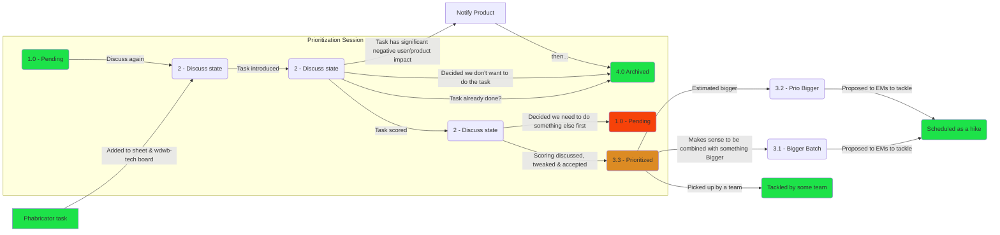

# Process

## Campsite

### Task ingestion

Campsite tasks come from a variety of places.

```mermaid
graph LR
A[Phabricator task created] -->|Tagged & Seen| B1(Wikidata product backlog)
A[Phabricator task created] -->|Tagged & Seen| B2(Wikibase product backlog)
A[Phabricator task created] -->|Tagged & Seen| B3(Wikidata / Wikibase Tech backlog)
A[Phabricator task created] -->|Tagged & Seen| B4(Design System backlog)

B1(Wikidata product backlog) -->|Prioritized by product| Backlog1(Prioritized backlog)
Backlog1(Prioritized backlog) -->|Product Polishing| CP1(Campsite Product Polishing)
CP1(Campsite Product Polishing) -->|Pickup attempt, weekly| C2(Campsite Storytime)

B2(Wikibase product backlog) -->|Prioritized by product| Backlog2(Prioritized backlog)
Backlog2(Prioritized backlog) -->|Product Polishing| CP2(Campsite Product Polishing)
CP2(Campsite Product Polishing) -->|Pickup attempt, weekly| C2(Campsite Storytime)

B3(Wikidata / Wikibase Tech backlog) -->|Brought to Prioritization Session | P3(Tech Prioritization Session)
P3(Tech Prioritization Session) -->|Prioritized| Backlog3(Tech prioritized backlog)
Backlog3(Tech prioritized backlog) -->|Groomed| CP3(Campsite Tech Polishing)
CP3(Campsite Tech Polishing) -->|Pickup attempt, weekly| C2(Campsite Storytime)

B4(Design System backlog) -->|Brought to Prioritization Session | P4(DS Grooming Session)
P4(DS Grooming Session) -->|Groomed & Prioritized| Backlog4(DS prioritized backlog)
Backlog4(DS prioritized backlog) -->|Pickup attempt, every 2 weeks| C2(Campsite Storytime)

C2(Campsite Storytime) -->|Estimated & picked up| C3(Campsite Iteration)
```



### Tech track

- Tech Lead will make sure the "Tech backlog" on the campsite board has appropriate ordered tasks at the top of it
- A "ticket polishing" session happens weekly with a member of the campsite to ensure the ticket makes sense and to write ACs
- The ticket is represented in a story time by the tech lead for pickup by the team
- Once picked up the task is archived from the tech prioritization system & moved to "Active" on the wdwb-tech board

## Tech Backlog

The tech backlog is primarily maintained on the [wdwb-tech workboard](https://phabricator.wikimedia.org/project/board/3532/).

### Tech prioritization

|             | Description |
| ----------- | ----------- |
| What        | A weekly 1 hour meeting to prioritize tasks.<br> Tasks are submitted, discussed, scored and sorted.<br>This assigns the responsibility of prioritising maintenance tasks to a group of dedicated, slowly rotating, people.<br>Prioritized tasks then get picked up by teams. |
| Who         | Tech lead, 1 Campsite representative, 1 Representative of each current hike. |
| Why         | The tech prioritization process was created to distribute the process of tech debt & maintenance prioritization, while incorporating views from all products. |
| Since       | June 2020 |
| Docs        | [2021-05 Summarizing blog post](https://addshore.com/2021/06/tackling-technical-debt-big-and-small-in-wikidata-and-wikibase/), [2020-06 Proposal](https://docs.google.com/document/d/1qpVtHoLT5lCbzNhbVpUwUtSNG6_XhM4QmN1aQoseyY0) |

If a significant product / user-facing concern is raised during the prioritization process, the task is not prioritized and instead handed to PMs.
Tech tasks with minor user impact may still be prioritized through the tech backlog, possibly in addition to product prioritization.

#### Goals

- Team as a whole will feel more involved in prioritization
- Prioritization process will be clearer for the whole team
- Tech backlog will be more organized
- Important tech tasks will organically surface
- Knowledge sharing will happen as prioritization happens

#### Prioritization scoring

The scoring system has evolved since the process was first introduced in 2020. The current system is called WAPS (WMDE Awesome Priority Score).

Ultimately the score is a single number, and the backlog is sorted using that number.

The current scoring system is largely based around [RICE](https://roadmunk.com/guides/rice-score-prioritization-framework-product-management/), but with yes/no questions to build both the reach and impact values.

The WAPS Score is made up of various components:

 - Stakeholders that care about the task being done
 - Impact calculated via weighted yes no (ish) questions
 - Effort in person weeks

The formula is currently very roughly:

```
(IMPACT * STAKEHOLDERS / EFFORT) * ( effort/impact adjustment ) + ( tiny increment )
```

- effort/impact adjustment: Aims to de-prioritize larger or lower impact things
- tiny increment: Based on the session number this aims to eliminate ties (by adding some decimal places, newer wins)

#### Process

The prioritization sessions focus around a [Google sheet](https://docs.google.com/spreadsheets/d/1Sa4x3XYqpK1v6s4HnIIKq327UVYXd38PpDyT-7PqtCo) and a fairly objective scoring system.

A new sheet is created every month:

- Current "Active" sheet is copied / duplicated to an "Archive"
- Copy all cells in the "Archive" sheet and paste in past "with values"
- All comments on the Active sheet are tended to
- All archived tasks are removed from the "Active" sheet
- Larger changes are made to the scoring system

The general process for attendees of the session is outlined below:

:::details Session leader guide

**Before the session**

- If there are not many tasks to discuss, check the `wdwb-tech` board and add some tasks from the inbox or backlog
- If tasks have been picked up by a team, archive them (adding the archived date)
- Make sure the sheet is sorted & presentable

**During the session**

- Introduce any people unfamiliar with the process to the process
- Start by introducing, scoring and discussing a task that you have brought to the session
- Repeat the process mixing up who talks about tasks a bit

Throughout:

- If people forget to populate the "Session Week" column as they are scoring, populate the column
- If people do not populate the "Prioritized date" column as they are scoring, populate the column
- If a task it already done, mark it as archived & set the archive date, leaving a note on the reason for archiving
- If a task has significant negative user/product impact, or needs other PM input, mark it as pending, leaving a note as to why
- As people comment on how the scoring system is good or bad, leave comments in cells to be tackled at the end of the month

**After the session**

- Click the "Sort the sheet" button
- Move all tasks to the appropriate columns on the `wdwb-tech` board
- Message PMs for any needed input, or tasks that are now on their plate
- Message EMs for any high prio "big" tasks that have appeared

:::

:::details Session attendee guide

**Before the session**

- Add any tasks that you or your team have come across and want to prioritize and represent to the sheet
  - Create a new row in the Discuss section, below the pending section (top of the sheet)
  - Add the task ID to the first column
  - Set the Status to discuss
  - Copy all formula for columns marked with a ⚡
  - Enter your name in the "Brought by" column
- If you feel comfortable with the scoring system score these in advance (It's fine to do this in the call too)

**During the session**

- When called on:
  - Introduce your ticket, giving people context to understand what it is, and why you are brining it
  - Run through the scores from left to right, ending with an effort estimation
  - Ask the round for feedback on your scores
  - Mark the status to prioritized, set the session week, and set the prioritized date
:::

**A general process flow**


