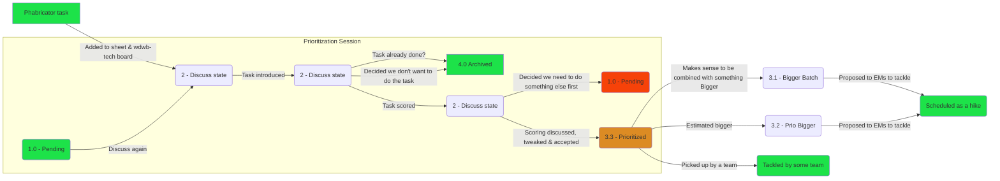

# Process

## Campsite

### Task ingestion

Campsite tasks come from a variety of places.

```mermaid
graph LR
A[Phabricator task created] -->|Tagged & Seen| B1(Wikidata product backlog)
A[Phabricator task created] -->|Tagged & Seen| B2(Wikibase product backlog)
A[Phabricator task created] -->|Tagged & Seen| B3(Wikidata / Wikibase Tech backlog)
A[Phabricator task created] -->|Tagged & Seen| B4(Design System backlog)

B1(Wikidata product backlog) -->|Prioritized by product| Backlog1(Prioritized backlog)
Backlog1(Prioritized backlog) -->|Product Polishing| CP1(Campsite Product Polishing)
CP1(Campsite Product Polishing) -->|Pickup attempt, weekly| C2(Campsite Storytime)

B2(Wikibase product backlog) -->|Prioritized by product| Backlog2(Prioritized backlog)
Backlog2(Prioritized backlog) -->|Product Polishing| CP2(Campsite Product Polishing)
CP2(Campsite Product Polishing) -->|Pickup attempt, weekly| C2(Campsite Storytime)

B3(Wikidata / Wikibase Tech backlog) -->|Brought to Prioritization Session | P3(Tech Prioritization Session)
P3(Tech Prioritization Session) -->|Prioritized| Backlog3(Tech prioritized backlog)
Backlog3(Tech prioritized backlog) -->|Groomed| CP3(Campsite Tech Polishing)
CP3(Campsite Tech Polishing) -->|Pickup attempt, weekly| C2(Campsite Storytime)


B4(Design System backlog) -->|Brought to Prioritization Session | P4(DS Grooming Session)
P4(DS Grooming Session) -->|Groomed & Prioritzed| Backlog4(DS prioritized backlog)
Backlog4(DS prioritized backlog) -->|Pickup attempt, every 2 weeks| C2(Campsite Storytime)

C2(Campsite Storytime) -->|Estimated & picked up| C3(Campsite Iteration)
```

## Tech Backlog

The tech backlog is primarily maintained on the [wdwb-tech workboard](https://phabricator.wikimedia.org/project/board/3532/).

### Tech prioritization

The prioritization sessions focus around a [Google sheet](https://docs.google.com/spreadsheets/d/1Sa4x3XYqpK1v6s4HnIIKq327UVYXd38PpDyT-7PqtCo) and a fairly objective scoring system.

