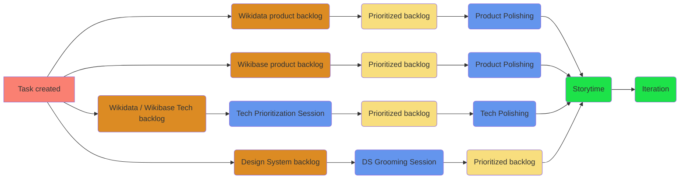

# Campsite

## Task ingestion

Campsite tasks come from a variety of places, but generally they all start life as Phabricator tasks, moving through one of 4 owned backlogs, the appropriate sessions to prepare the task for pickup, eventually making their wait to the Campsite storytime and iterration.

## Tech polishing

Tech polishing happens before the Campsite received tickets from the tech backlog to the Campsite Storytime.

<ProcessTable
  :what="[
    'A weekly 45 minuite meeting to polish tech backlog tickets about to head to Campsite Dtorytime.',
  ]"
  :why="[
    'Specify possible missing details in the tickets to be presented in the Campsite Storytime',
    'Have a more productive and time-efficent Storytime meeting, by having som questions asked in advance'
  ]"
  who="Tech lead (or representative), Campsite representative"
  since="November 2020"
/>

:::details Campsite representative

If you want to have a look at what will be polished ahead of time, ask the Tech lead (or representative) to ensure the "Prioritized tech" column is up to date and ready.

**During the session**

- Provide questions, thoughts and input on the tasks in the "Prioritized tech" column (that will be brought to the campsite storytime)
- Ensure the task is clear and could be picked up by the campsite

**After the session**

- Report on mattermost to the campsite channel about the tasks that were polished

:::

:::details Tech lead (or representative)

**Before the session**

- Check the Campsite iteration board & talk to other Campsite inputers to see how many tasks it might make sense to bring to the Storytime.
- Add the highest scored tasks from the tech backlog to the "Prioritized tech" column on the Campsite board, ordered from highest to loweest.
- Do not add things that are blocked and thus can not be picked up.
- Keep the "Prioritized tech" column lean, removing anything that is no longer at the top of the tech backlog from the board.

**During the session**

- Introduce the campsite representative to the polishing session if needed
- Iterate through the tasks in the "Prioritized tech" column as time allows
  - Acceptance criteria should be added to the tasks

:::

- Tech Lead will make sure the "Tech backlog" on the campsite board has appropriate ordered tasks at the top of it
- A "ticket polishing" session happens weekly with a member of the campsite to ensure the ticket makes sense and to write ACs
- The ticket is represented in a story time by the tech lead for pickup by the team
- Once picked up the task is archived from the tech prioritization system & moved to "Active" on the wdwb-tech board
