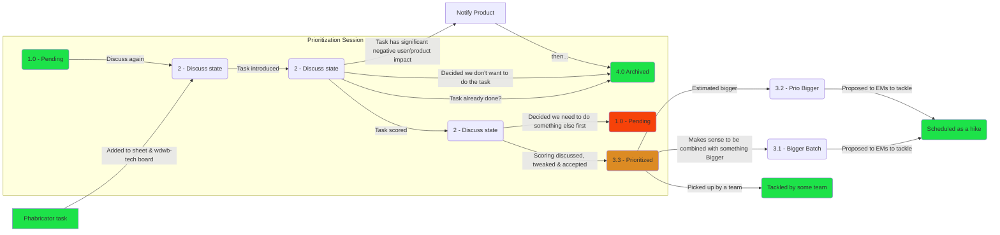

# Tech Backlog

The tech backlog is primarily maintained on the [wdwb-tech workboard](https://phabricator.wikimedia.org/project/board/3532/), and managed by the prioritization session and Tech Lead.

## Prioritization session

<ProcessTable
  :what="[
    'A weekly 1 hour meeting to prioritize tasks.',
    'Tasks are submitted, discussed, scored and sorted.',
    'Tasks are submitted, discussed, scored and sorted.',
    'Prioritized tasks then get picked up by teams (usually Campsite).',
  ]"
  :why="[
    'Prioritization process will be clearer for the whole team.',
    'Process of prioritization is distributed.',
    'Backlog will be more organized.',
    'Team as a whole will feel more involved in prioritization.',
    'Important tech tasks will organically surface.',
    'Knowledge sharing will happen during prioritization.',
    'A wide range of views will be incorporated.',
  ]"
  who="Tech lead (or representative), Campsite representative, A representative of each current hike, Anyone that wishes to represent a task"
  since="June 2020"
  :docs="[
    {name: '2021-05 Summarizing blog post', url: 'https://addshore.com/2021/06/tackling-technical-debt-big-and-small-in-wikidata-and-wikibase/'},
    {name: '2020-06 Proposal', url: 'https://docs.google.com/document/d/1qpVtHoLT5lCbzNhbVpUwUtSNG6_XhM4QmN1aQoseyY0'},
  ]"
/>

The prioritization sessions focus around a [Google sheet](https://docs.google.com/spreadsheets/d/1Sa4x3XYqpK1v6s4HnIIKq327UVYXd38PpDyT-7PqtCo) and a fairly objective scoring system (detailed below).

If a significant product / user-facing concern is raised during the prioritization process, the task is not prioritized and instead handed to PMs.
Tech tasks with minor user impact may still be prioritized through the tech backlog, possibly in addition to product prioritization.

:::details Session leader guide

**Before the session**

- If there are not many tasks to discuss, check the `wdwb-tech` board and add some tasks from the inbox or backlog
- If tasks have been picked up by a team, archive them (adding the archived date)
- Make sure the sheet is sorted & presentable

**During the session**

- Introduce any people unfamiliar with the process to the process
- Introduce the sheet changes, if any have been made you are aware of
- Start by introducing, scoring and discussing a task that you have brought to the session
- Repeat the process, picking who goes next if tasks were brought, or poking to see who might want to represent a ticket. (Mix around who talks)

**Throughout the session**

- As people talk about their task:
  - Make the task as "Prioritzed" if it was missed
  - Populate the "Prioritized date" column
- If a task it already done, mark it as archived & set the archive date, leaving a note on the reason for archiving
- If a task has significant negative user/product impact, or needs other PM input, mark it as pending, leaving a note as to why
- As people comment on how the scoring system is good or bad, leave comments in cells to be tackled at the end of the month

**After the session**

- Click the "Sort the sheet" button
- Move all tasks to the appropriate columns on the `wdwb-tech` board
- Message PMs for any needed input, or tasks that are now on their plate
- Message EMs for any high prio "big" tasks that have appeared

:::

:::details Session attendee guide

**Before the session**

- Add any tasks that you or your team have come across and want to prioritize and represent to the sheet
  - Create a new row in the Discuss section, below the pending section (top of the sheet)
  - Copy all formula for columns marked with a ⚡
  - Fill in the first green columns
    - Phabricator task ID
    - Set the Status to "Discuss"
    - Enter your name in the "Brought by" column
- If you feel comfortable with the scoring system score these in advance (It's fine to do this in the call too)

**During the session**

- When others are representing tasks:
  - Get an understanding of the task, what it means, what it aims to do and why.
  - Provide feedback about the scores other participants gave to the tasks that they are presenting.

- When called on:
  - Introduce your ticket, giving people context to understand what it is, and why you are brining it
  - Run through the scores from left to right, ending with an effort estimation
  - Ask the round for feedback on your scores
  - Mark the status to prioritized, set the session week, and set the prioritized date
:::

:::details Tech lead monthly guide

Each month, to keep sheet size down and speed up a new sheet should be created.

- Current "Active" sheet is duplicated, and the duplicate renammed as an archive copy of the current state.
- All cells on the new archive sheet are copied and pasted using the "with values" feature, which will remove all formula.
- All comments on the new Active sheet are tended to, including changes to the scoring system.
- All archived task rows are deleted from the new "Active" sheet.

:::

### Details

#### States

States are numbered to aid in sorting and visibility on the sheet.

- 1 - **Pending**: Generally on the radar of the session, but might not be discussed in the next session.
- 2 - **Discuss**: Try and discuss in the next session.
- 3.3 - **Prioritized**: Already been through the process and acquired a score.
- 3.2 - **Prio Bigger**: Already been through the process and acquired a score. But estimated at more 2 or more weeks work, so not fitting for a simple Campsite or Team pickup. Must be funneled into initiatives for the EMs.
- 3.1 - **Bigger Batch**: Not neccesarily been through the process, but these tasks make sense to bundle with other bigger tasks, or as a set of small things. Must be funneled into initiatives for the EMs.
- 4 - **Archived**: Is closed, or picked up by a team.



#### Meaning of columns

<TechPrioSheetTable
  :columns="[
    { 
      name: 'X: UX, PM, EM, Dev',
      descr: 'Does the ticket affect the work of any of those teams? 1 per internal team - UX, PM, EM, Devs, Tech Writer.',
    },
    { 
      name: 'WMF Product Teams',
      descr: 'Does the ticket affect the work of WMF Product teams? 1 for each distinct Product team, such as WMF Core Platform, WMF Structured Data, WMF Search Platform.',
    },
    { 
      name: 'X: WMF Eng teams',
      descr: 'Does the ticket affect the work of WMF Engineering teams? 1 for each distinct tech team, such as Service OPs, DBA, Release Engineering, Performence, Security, Cloud Services.',
    },
    { 
      name: 'X: Volunteer Devs',
      descr: 'Does the ticket affect the work of volunteer developers?',
    },
    { 
      name: 'A: WMF Production Sites',
      descr: 'Does the ticket affect any WMF production sites?',
    },
    { 
      name: 'B: Wikibase 3rd parties',
      descr: 'Does the ticket affect the work 3rd party Wikibase users?',
    },
    { 
      name: 'Security',
      descr: 'Is the ticket related to security issues - both for production code (1 point) and development code (0.5 points)?',
    },
    { 
      name: 'Prevented merging of code',
      descr: 'Is the issue preventing merging of code, e.g. broken CI?',
    },
    { 
      name: 'Performance',
      descr: 'Is the ticket related to improving production performance?',
    },
    { 
      name: 'CI Stability / Speed / Ease',
      descr: 'Does the task relate to improving CI stability, speed or ease of use for both WMDE and others e.g. WMF? 1 point for big improvements or issues, 0.5 for small ones. ',
    },
    { 
      name: 'ADR Compliance',
      descr: 'Does the task describe something to be done in line with some of our accepted ADRs?'
    },
    { 
      name: 'External Code Review',
      descr: 'This task was done by an external person and now needs review from us.',
    },
    { 
      name: 'Deprecated Removal',
      descr: 'This tasks stops using a deprecated tool/class/module etc.',
    },
    { 
      name: 'Test Coverage',
      descr: 'This task will improve our test coverage.',
    },
    { 
      name: 'Documentation',
      descr: 'This task has to do with any kind of documentation that developers are responsible for.',
    },
    { 
      name: 'Dev Environment',
      descr: 'This task has to do with WMDE\'s dev environment.',
    },
    { 
      name: 'Confusing, smelly, old code',
      descr: 'This task is related to improving confusing or smelly code.',
    },
    { 
      name: 'Consistency & Readability',
      descr: 'This task will make a part of the code consistent with how we do things elsewhere',
    },
    { 
      name: 'Using shiny things',
      descr: 'This task will introduce modern tools, technologies, patterns etc.',
    },
    { 
      name: 'Team A Focus: Blocked MW Train',
      descr: 'Solving this task will unblock mediawiki\'s train',
    },
    { 
      name: 'Team A Focus: Incident Prevention',
      descr: 'Has this been identified as a way to prevent a previous or predicted production incident?',
    },
    { 
      name: 'Team A Focus: Logstash Log spam',
      descr: 'This task fixes something that creates log spam in Logstash',
    },
    { 
      name: 'Team A Focus: Production Performance',
      descr: 'This task is about production performance of products/projects in Team A\'s jurisdiction',
    },
    { 
      name: 'Team A Focus: Manual Intervention',
      descr: 'This task will improve/automate something that has been done manually so far.',
    },
    { 
      name: 'Team A Focus: Out of train deploy',
      descr: 'This task will require deployment out of mediawiki\'s train',
    },
    { 
      name: 'Team B Focus: Blocking 3rd party deploy',
      descr: 'Solving this task will unblock deployment of products used by 3rd parties.',
    },
    { 
      name: 'Team B Focus: Incident Prevention',
      descr: 'Has this been identified as a way to prevent a previous or predicted production incident?',
    },
    { 
      name: 'Team B Focus: Log spam',
      descr: 'This task fixes something that creates log spam.',
    },
    { 
      name: 'Team B Focus: Performance',
      descr: 'This task is about performance of products/projects in Team B\'s jurisdiction',
    },
    { 
      name: 'Team B Focus: Manual Intervention',
      descr: 'This task will improve/automate something that has been done manually so far.',
    },
    { 
      name: 'Team B Focus: Increase Debugability',
      descr: 'This task will improve the ability to debug problems in Team B\'s products.',
    },
    { 
      name: 'Future planned work',
      descr: 'The project/product/code etc. the task relates to has future work planned for it.',
    },
    { 
      name: 'Effort (in person weeks)',
      descr: 'How much effort in person weeks will this task take? The possible values are from 0.2 to 8. Big estimations usually mean that the task should turn into a hike.',
    },
  ]"
/>

#### Scoring

Ultimately the score is a single number, and the backlog is sorted using that number. This was inspired by [RICE](https://roadmunk.com/guides/rice-score-prioritization-framework-product-management/) and [User Pain](https://lostgarden.home.blog/2008/05/20/improving-bug-triage-with-user-pain/).

```
( SUM OF IMPACT ) * ( 1 + SUM OF REACH ) * ( ( EFFORT WEIGHT + WEEK MODIFIER ) * 10 ) / 4
```

- **SUM OF IMPACT**: Aims to prioritize on key things that we care about. This is a SUM of impacts from both team focuses (includes some duplication)
- **SUM OF REACH**: Aims to prioritize things that have a broader reaching impact or that more folks care about
- **EFFORT WEIGHT**: Aims to prioritize higher impact lower effort things first
- **WEEK MODIFIER**: Aims to give new things a tiny decimal edge, so that we don't have ties

As the score makeup evolves the higher end pickup mark should aim to stay around 100+ (which is why the current score is `/4`